# Fast Forth System Diagrams
**Visual Architecture Reference**

This document contains mermaid diagrams visualizing the Fast Forth architecture. These diagrams can be rendered in GitHub, GitLab, or any mermaid-compatible viewer.

---

## 1. Overall System Architecture

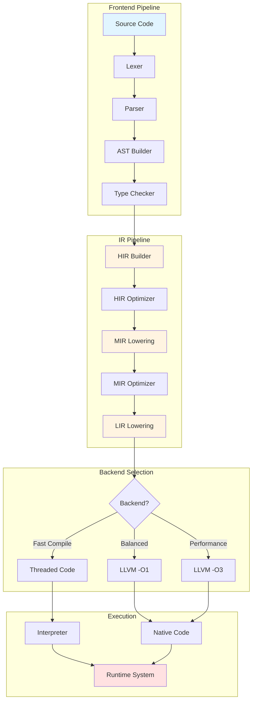

---

## 2. Type Inference Flow

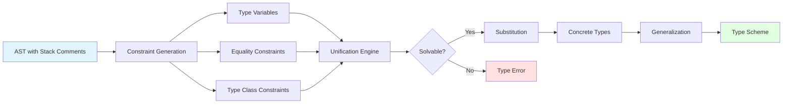

---

## 3. IR Transformation Pipeline

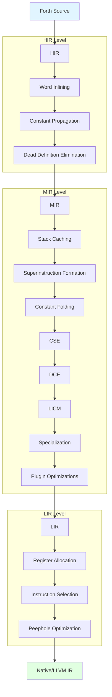

---

## 4. Stack Caching Architecture

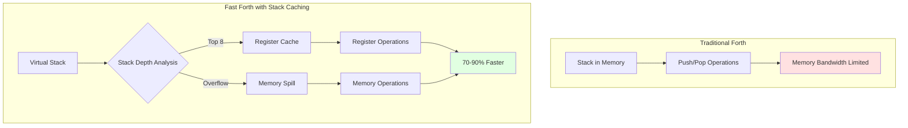

---

## 5. JIT Tiering Strategy

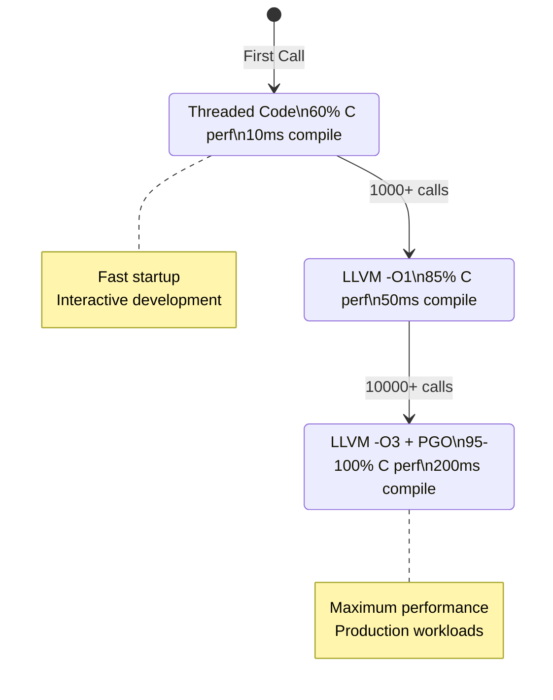

---

## 6. Plugin Architecture

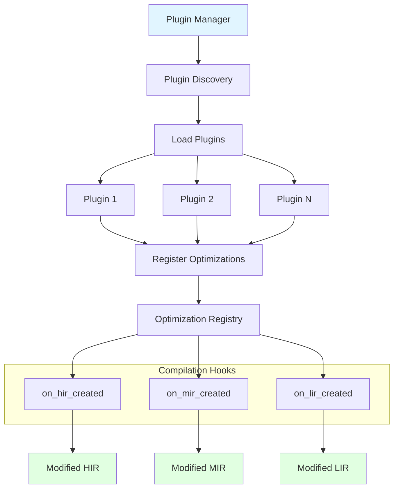

---

## 7. Type System Components

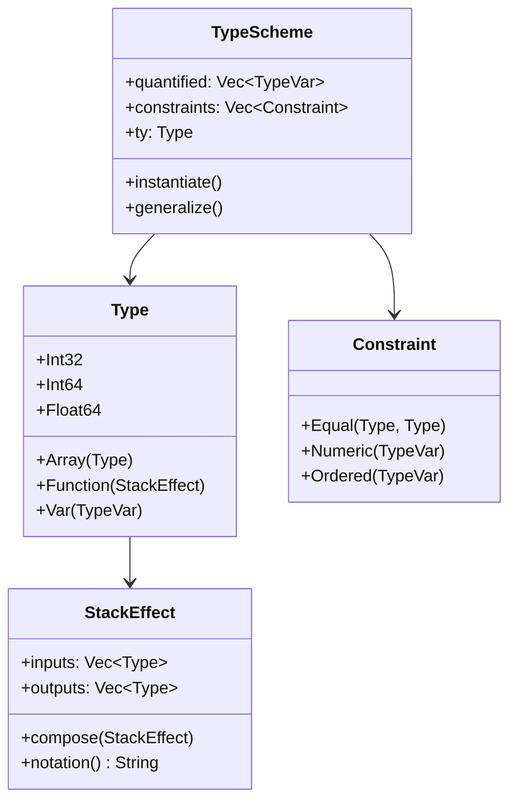

---

## 8. Compilation Pipeline Data Flow

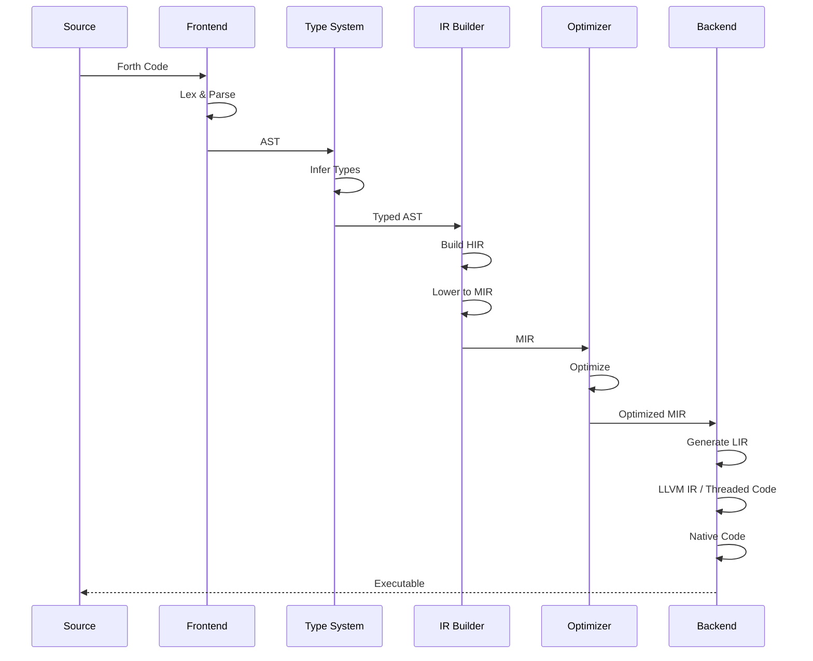

---

## 9. Register Allocation

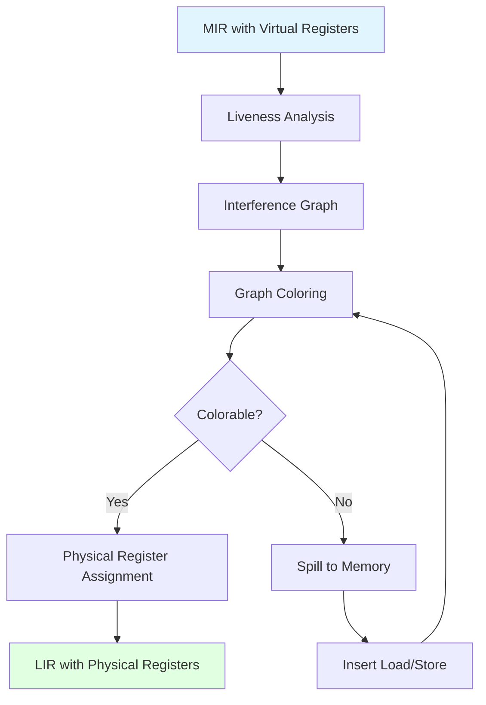

---

## 10. Error Reporting Flow

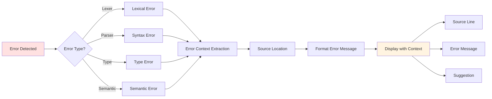

---

## 11. Memory Layout

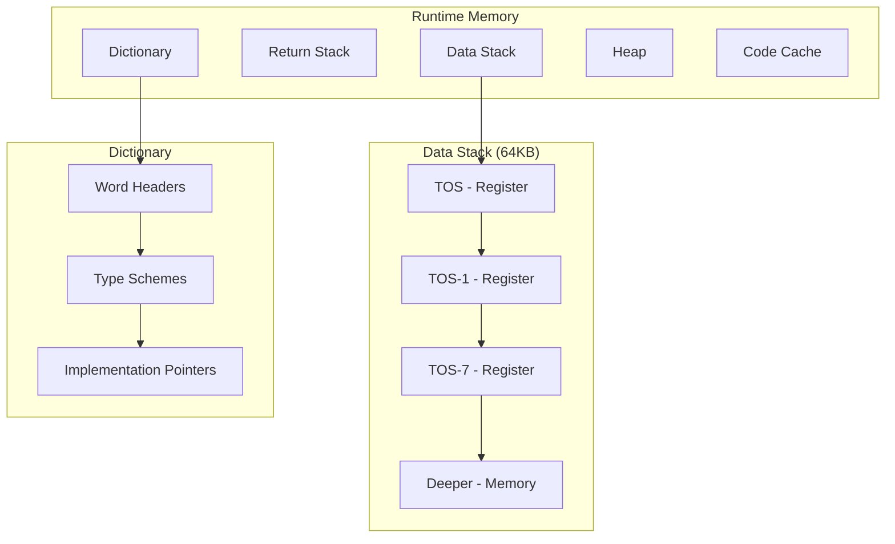

---

## 12. Optimization Pass Order

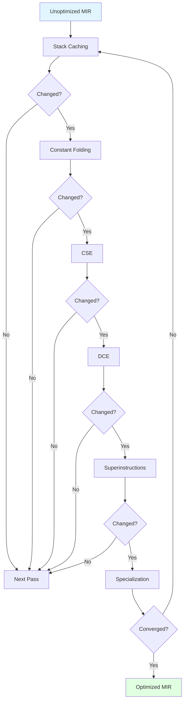

---

## 13. Development Streams Timeline

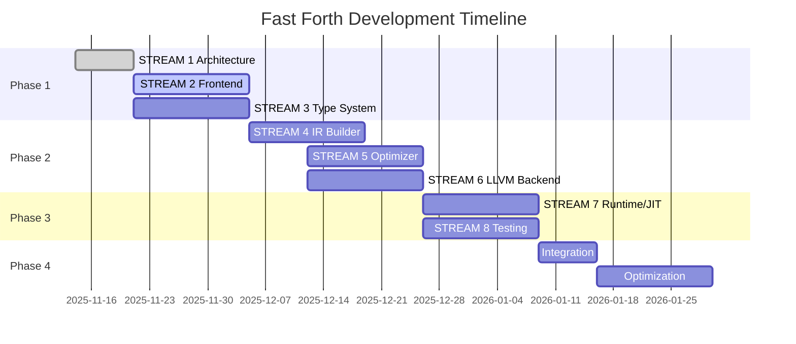

---

## 14. Component Dependencies

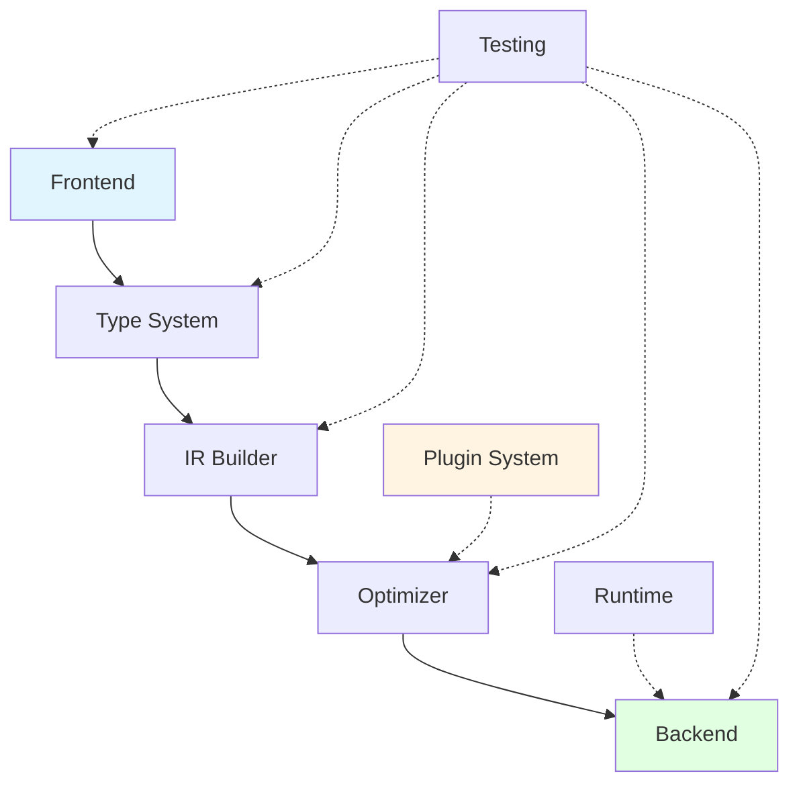

---

These diagrams provide visual reference for the Fast Forth architecture. For implementation details, see:
- [ARCHITECTURE.md](ARCHITECTURE.md)
- [ARCHITECTURE_QUICKSTART.md](ARCHITECTURE_QUICKSTART.md)
- [IR_SPECIFICATION.md](../specs/IR_SPECIFICATION.md)
- [TYPE_SYSTEM_SPECIFICATION.md](../specs/TYPE_SYSTEM_SPECIFICATION.md)

---

**Generated by**: Architect Agent (STREAM 1)
**Date**: 2025-11-14
**Version**: 1.0
